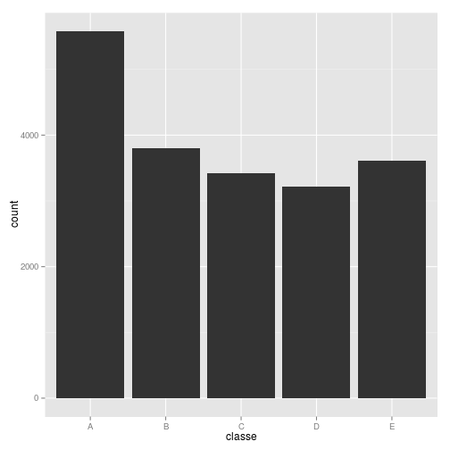

<h2>Introduction</h2>

This report aims to predict the manner into which people execute the uplift of a dumbbell with respect to the qualifty of the movement. The predicted behaviour is coded as a factor variable with 5 (five) levels. Class A corresponds to the correct execution of the exercise and the other classes reflects common mistakes. The original dataset is compounded by cerca 150 predictors and 1 (one) response variable named "classe".

In this report, it's described how a model was built, how the cross validation technik was used and what's the expected ou of sample error. After that, the built model is applied to predict 20 test cases drawn from the test dataset.

For the original dataset and considerations made by their authors, visit http://groupware.les.inf.puc-rio.br/har. The dataset is licensed under the Creative Commons license (CC BY-SA).

<h2>Describing the data</h2>

The data consists basically of sequential measurements of sensors weared in the people that participated in the experiment. There were a glove sensor, an arm-band sensor, a belt sensor anda a dumbbell sensor. There were also an accelerometer, a gyroscope anda a magnetometer. Measurments were taken with respect to different angles according to the respective axis, namely, x, y and z or roll, pitch and yaw. For the frist four sensors (dumbbell, glove, forearm and belt sensors), there was measurements of its min, max, mean, amplitude, variance, standard deviation, kurtosis and skewness.

Other variables tell about the name of the volunteer, timestamp and number of the sliding window.

All variables relative to the sensors measurements are numerical data. Nonetheless, some variables, initially expected to be numeric, were actually treated as a 'chr' vector, once they all were filled with NA.


<h2>Preprocessing data</h2>

The training and testing datasets are loaded with read.csv.


```r
web_training <- "https://d396qusza40orc.cloudfront.net/predmachlearn/pml-training.csv"
web_testing <- "https://d396qusza40orc.cloudfront.net/predmachlearn/pml-testing.csv"

if(!file.exists("./pml-training.csv")){
  download.file(url = web_training, destfile="./pml-training.csv", method = "wget")
}

if(!file.exists("./pml-testing.csv")){
  download.file(web_testing, destfile="./pml-testing.csv", method="wget")
}
```


```r
training <- read.csv("pml-training.csv", header = TRUE, 
                     sep = ",", dec = ".",na.strings = c("NA"),
                     blank.lines.skip = TRUE, strip.white = TRUE,
                     stringsAsFactors = FALSE)

testing <- read.csv("pml-testing.csv", header = TRUE,
                     sep = ",", dec = ".",na.strings = c("NA"),
                     blank.lines.skip = TRUE, strip.white = TRUE,
                     stringsAsFactors = FALSE)
```

The response variable is like the following barplot distributed.


```r
library(ggplot2)
ggplot(aes(classe),data=training) + geom_bar()
```

 

```r
table(training$classe)
```

```
## 
##    A    B    C    D    E 
## 5580 3797 3422 3216 3607
```

Initially, the training data were reduced to the raw_time_stamp_part2, cvtd_timestamp, numerical predictors (columns 8 to 159) and the response variable (column 160).


```r
dim(training)
```

```
## [1] 19622   160
```

```r
idxVerbose <- c(1:3,5,6)
trainingSS <- training[,-idxVerbose]
```

Next, it is necessary to exclude the vectors containing whose values consist 90% or more of NA values.


```r
nr <- dim(trainingSS)[1]
idxSparse <- (sapply(trainingSS, function(x) sum(is.na(x)))/nr)>.9
trainingSS2 <- trainingSS[,-idxSparse]
```

Still preparing the data to analysis, it's useful to remove the vectors which less explain the variability present in the data.


```r
library(caret)
indZeroVar <- nearZeroVar(trainingSS2)
indZeroVar
```

```
##  [1]   6   7   8   9  10  11  14  17  20  45  46  47  48  49  50  51  52
## [18]  53  63  64  65  66  67  68  69  72  73  75  76  81  82  83  84  85
## [35]  86  89  92  95 119 120 121 122 123 124 125 127 128 130 131 133 136
## [52] 137 138 139 140 141 142 143 144
```

```r
trainingSS3 <- trainingSS2[,-indZeroVar]
dim(trainingSS3)
```

```
## [1] 19622    95
```

With respecto to the response variable, it's useful to convert this vector into a factor variable.


```r
trainingSS3$classe <- factor(trainingSS3$classe)
ds <- trainingSS3
```

It's also important to have validation dataset in hand, to estimate the out of sample error later.


```r
library(caret)
inTrain <- createDataPartition(ds$classe, p = .8, list = FALSE)
tds <- ds[inTrain,]
vds <- ds[-inTrain,]
```

Now, it's useful to load and explore the testing dataset. There are some vectors that are completed empty. So it's not useful to use those variables in the model building. An index is used to exclude from the training set the variables that are not available in the test set.


```r
testingSS <- testing[,-idxVerbose]
testingSS <- testingSS[,-idxSparse]
testingSS <- testingSS[,-indZeroVar]
testingSS <- testingSS[,names(testingSS)!="problem_id"]
idxNamesTestingMissing <- names(testingSS[,(apply(testingSS, 2, function(x) sum(is.na(x))==20))])

tds <- tds[,!(names(tds)%in%idxNamesTestingMissing)]
vds <- vds[,!(names(tds)%in%idxNamesTestingMissing)]
```


<h2>Building The Model</h2>

Once the dataset has being prepared for training, it's necessary to choose a method for the prediction model. In this report, it's choosen the caret package and the method applied for modeling is the multinomial logistic regression.


```r
library(caret)
ctrl <- trainControl(method="cv", number=3, repeats=2)
mdl <- train(classe ~ ., data=tds, 
             na.action = na.omit, method="LogitBoost", trControl=ctrl)

confusionMatrix(mdl)
```

```
## Cross-Validated (3 fold) Confusion Matrix 
## 
## (entries are percentages of table totals)
##  
##           Reference
## Prediction    A    B    C    D    E
##          A 29.3  1.1  0.1  0.1  0.2
##          B  0.5 15.9  0.6  0.1  0.5
##          C  0.1  0.7 15.4  0.8  0.1
##          D  0.3  0.3  0.4 14.8  0.6
##          E  0.0  0.2  0.1  0.3 17.5
```

<h2>Predicting</H2>


```r
library(caret)
predictions <- predict(mdl, newdata = testingSS, na.action = na.omit)
table(predictions)
```

```
## predictions
## A B C D E 
## 8 3 1 1 3
```

<h2>The Out of Sample Error and Cross-Validation</h2>

Out of sample error is the error that imports most. It corresponds to the errors of the model when it's applied to new data i.e. data not used to build the model. This type of error tends to be greater than the in sample error. The reason is the overfitting of the model to the training data.

The following data show the estimate of out of sample error calculated from the validation dataset.


```r
valPredictions <- predict(mdl, newdata = vds, na.action = na.omit)
confusionMatrix(valPredictions, vds$classe)
```

```
## Confusion Matrix and Statistics
## 
##           Reference
## Prediction   A   B   C   D   E
##          A 994  29   0   2   8
##          B  18 570  27  10   8
##          C   3  34 540  22   2
##          D  10   4  15 473  13
##          E   5   6   4  23 634
## 
## Overall Statistics
##                                          
##                Accuracy : 0.9296         
##                  95% CI : (0.9206, 0.938)
##     No Information Rate : 0.2982         
##     P-Value [Acc > NIR] : < 2e-16        
##                                          
##                   Kappa : 0.9106         
##  Mcnemar's Test P-Value : 0.02898        
## 
## Statistics by Class:
## 
##                      Class: A Class: B Class: C Class: D Class: E
## Sensitivity            0.9650   0.8865   0.9215   0.8925   0.9534
## Specificity            0.9839   0.9776   0.9787   0.9856   0.9864
## Pos Pred Value         0.9622   0.9005   0.8985   0.9184   0.9435
## Neg Pred Value         0.9851   0.9741   0.9839   0.9806   0.9889
## Prevalence             0.2982   0.1862   0.1697   0.1534   0.1925
## Detection Rate         0.2878   0.1650   0.1563   0.1369   0.1836
## Detection Prevalence   0.2991   0.1833   0.1740   0.1491   0.1946
## Balanced Accuracy      0.9745   0.9320   0.9501   0.9390   0.9699
```

<H2>Conclusion</h2>

From the above results, it's possible to conclude that the predictive value of the model is significative.

<h2>REFERENCE</h2>

Velloso, E.; Bulling, A.; Gellersen, H.; Ugulino, W.; Fuks, H. Qualitative Activity Recognition of Weight Lifting Exercises. Proceedings of 4th International Conference in Cooperation with SIGCHI (Augmented Human '13) . Stuttgart, Germany: ACM SIGCHI, 2013.
